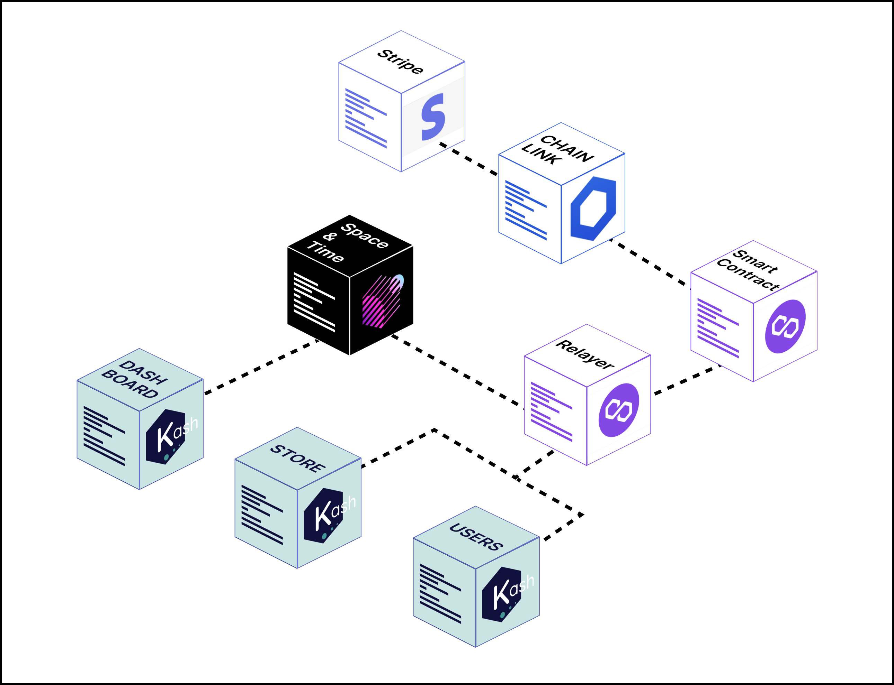

## Hi there 👋

### Repositories

- [kash-pwa-customer](https://github.com/Kash-payments/kash-pwa-customer): An app for users to make payments at music festivals easily and conveniently.
- [kash-pwa-store](https://github.com/Kash-payments/kash-pwa-store): An app for stores to process charges for users, providing a seamless payment experience.
- [kash-dash](https://github.com/Kash-payments/kash-dash): An analytical dashboard designed for festival owners, offering detailed and visually appealing insights into their events.
- [kash-api](https://github.com/Kash-payments/kash-api): An API that enables data transmission through space and time, providing a streamlined interface for interacting with the Kash platform.
- [kash](https://github.com/Kash-payments/kash): Smart contracts powering the infrastructure and business logic behind the Kash platform.
- kash-back: Simplifies user authentication by integrating the Supabase platform, making it effortless to manage authenticated users within the Kash platform.
- [kash-landing](https://github.com/Kash-payments/kash-landing): Landing page showcasing the features and benefits of the Kash platform.

### Demo
To get the best experience, we highly recommend viewing the demos on a mobile screen.
- [Kash PWA Customer](https://kash-client.netlify.app/login)
- [Kash PWA Store](https://kash-store.netlify.app/login)
- [Kash Dash](https://kash-dashboard.netlify.app/login)
- [Kash Landing](https://kash-landing.netlify.app/)

### Problem

Have you ever been to a music festival, feeling the beat and ready to buy something to eat, but then forced to spend an eternity in line, waiting to pay cash? Or have you bought tickets to events that were later cancelled, leaving you with an unusable balance on a cashless wristband? These are common problems at mass events, especially in Latin America.

### Solution

This is where Kash comes in. Our project, built on blockchain, aims to improve the payment experience at mass events by integrating cashless technology with reusable balance and taking it to the next level.

### Market size

Latin America has a huge market for mass events, with millions of people attending festivals and other events every year. It is a market that is ripe for innovation and in dire need of a better payment solution.

Specifically, the category of arts, entertainment and recreation and other service activities such as festivals and concerts saw growth of 58.7% from 2016 to early 2020. By the middle of 2021 and until the end of 2022, a reactivation of concerts and festivals of 20.4% was recorded, slightly higher compared to previous years and taking into account the pandemic times.

### Product

Kash allows users to load money into their account through debit or credit card payments and store it in their personal wallet. In addition, unlike other systems, the balance in Kash does not expire, allowing users to reuse it for future events or reload it as needed.

Our solution is not only limited to end users, we know that merchants and event organizers are also very important, that is why with Kash they will be able to obtain detailed analysis of each event, accessing information about the transactions made by users, real-time statistics per event and a complete history of Kash usage in different periods of time.

### **Our competitive advantages are:**

1 - Reuse of balance as we aim to be in different events related to entertainment.

2 - Security and transparency as our entire solution is on blockchain.

3 Creation of metrics for the event owner which will help him to make decisions for future events.

4 Avoid losing the balance because the traditional solutions when you go to an event you get a wristband with a qr and if you lose your wristband you will lose your balance forever, with our solution that will be left behind.

5 We reduce the damage to the environment, since our solution is totally digital.

### Team

[Arturo Guerrero : Back  End Deveoper](https://github.com/arturxdev)

[Brandon Reyes : Front End Developer](https://github.com/brandonitas)

[Sandra Hernandez : Product Designer](https://www.linkedin.com/in/sandrahernandezm/)

[Camila Pineda : Product Designer](https://www.linkedin.com/in/camila-pineda)

[Daniel : Bussines Developer](https://github.com/arturxdev)

### Dependencies

 
 
 
 

